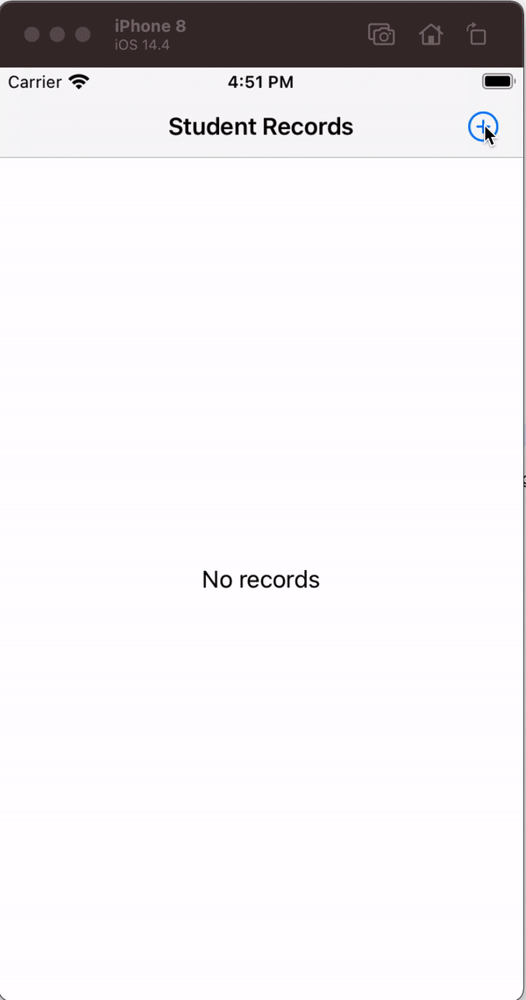

# iOS-Libraries

# Core Data
## Requirements:
* iOS 13.0+
* Xcode 12 or above
* Swift 5.0

## Objective:
The objective of this sample is to persist data using core data framework.

## Feature Supports:
- Insert
- Fetch
- Update
- Delete

## Installation

- Xcode **12**(required)
- Download the sample
- Clean `/DerivedData` folder if any
- Then clean and build the project in Xcode

 ####  Demo Video
 

